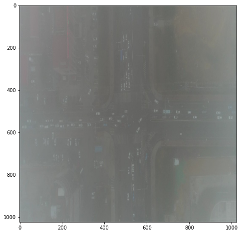
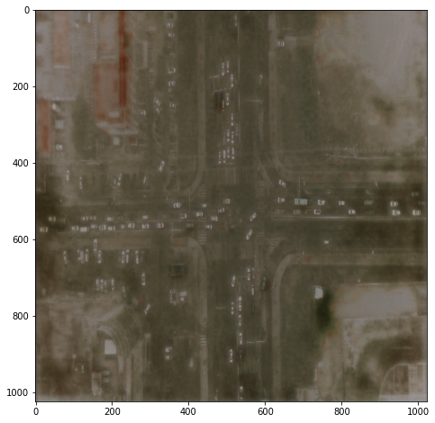

## Dehazing by GANs

 

#### ! under development !

### Dataset
O-HAZE has been used, it contains 45 different outdoor scenes depicting the same visual content recorded in haze-free and hazy conditions.
<a href="https://data.vision.ee.ethz.ch/cvl/ntire18/o-haze/">link</a>